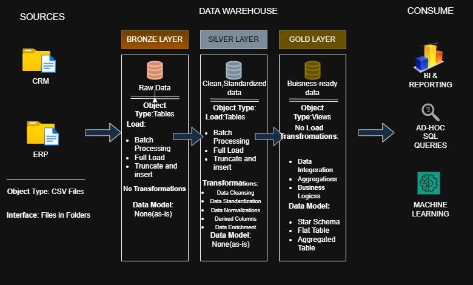

# 🏢 SQL Data Warehouse & Analytics Project

Welcome to the **SQL Data Warehouse & Analytics Project** repository! 🚀  
This project showcases the **end-to-end process** of building a modern data warehouse using **SQL Server**, complete with **ETL pipelines**, **data modeling**, and **SQL-based analytics**.

> 🎯 Designed as a portfolio project demonstrating industry best practices in **Data Engineering** and **Data Analytics**.

---

## 📌 Project Overview

The goal of this project is to build a centralized data warehouse that consolidates data from multiple business sources to enable insightful analytics and reporting.

### 🔍 Objectives:
- Build a scalable data warehouse on **SQL Server**
- Integrate ERP & CRM datasets
- Perform **cleansing, normalization**, and **dimensional modeling**
- Enable business-friendly SQL-based **analytical queries**

---

## ⚙️ Project Requirements

### 🛠️ Data Engineering

**Goal:**  
Develop a modern data warehouse using **SQL Server** that supports analytical queries and business reporting.

**Key Tasks:**
- Import data from ERP & CRM (CSV format)
- Cleanse and standardize inconsistent data
- Integrate data into a **star schema** (facts and dimensions)
- Focus on the **latest dataset** only (no historization)
- Provide clear **documentation** (ERD, data dictionary)

---

### 📊 Data Analysis & Reporting

**Goal:**  
Create actionable SQL-based insights for business stakeholders.

**Key Focus Areas:**
- 🧍‍♀️ **Customer Behavior**: Purchase patterns, segments, engagement
- 📦 **Product Performance**: Top sellers, underperformers
- 💹 **Sales Trends**: Seasonality, revenue analysis, regions

**Deliverables:**
- Analytical SQL queries
- KPIs and metrics
- (Optional) Dashboards in **Power BI** or **Tableau**
- Use case documentation

---

## 🧰 Tools & Technologies

- **Database**: Microsoft SQL Server
- **Languages**: SQL (T-SQL)
- **ETL**: SQL Scripts
- **Data Sources**: ERP & CRM CSV Files
- *(Optional)* Visualization: Power BI / Tableau
- **Version Control**: Git, GitHub

---

## 🏗️ Data Architecture

The data pipeline follows the **Medallion Architecture** with three layers:



| Layer        | Description                                                                 |
|--------------|-----------------------------------------------------------------------------|
| **Bronze**   | Raw data ingestion from ERP & CRM CSV files into SQL Server                |
| **Silver**   | Cleaned, standardized, and enriched data ready for analytical queries       |
| **Gold**     | Business-ready **fact** and **dimension** tables modeled for reporting      |

---

## 📖 Project Breakdown

### 1. Data Architecture
Designing a modern warehouse using **Bronze → Silver → Gold** structure

### 2. ETL Pipelines
SQL scripts to:
- Extract from source
- Clean and standardize
- Transform into analytical models

### 3. Data Modeling
Create dimension and fact tables optimized for analytical workloads

### 4. Analytics & Reporting
Write SQL to support business insights and reporting use cases

> 🔎 A great project for showcasing skills in:
- SQL Development  
- Data Modeling  
- Data Engineering  
- ETL Pipeline Design  
- BI & Analytics

---

## 📂 Folder Structure

-- Project Directory Structure
sql-data-warehouse-project/
│
├── datasets/              -- Contains source CSV files from ERP and CRM systems
├── scripts/               -- SQL scripts for ETL, transformation, and data loading
├── docs/                  -- Documentation such as data dictionary, ER diagrams, schema details
├── diagrams/              -- Data architecture diagrams (e.g., Medallion Architecture, star schema)
├── dashboards/ (optional) -- Power BI or Tableau reports and dashboards
└── README.md              -- Main project documentation (this file)

---

## 👩‍💻 About Me

Hi! I'm **Sanjukta Mukherjee**, a final-year BTech Computer Science student at **VIT AP University**.

I'm passionate about:

- 🔧 **Data Engineering & Analytics**
- 💻 **SQL, Python, and Web Development**
- 🤖 **Artificial Intelligence and Machine Learning**

> This project reflects my interest in solving real-world business problems using data.

🔗 **LinkedIn**: [linkedin.com/in/sanjukta-mukherjee](https://www.linkedin.com/in/sanjukta-mukherjee)  
📧 **Email**: sanjuktag0203@gmail.com

---

## 🙌 Acknowledgments

Special thanks to:

- The **Data Engineering & Analytics community** for amazing resources
- **Microsoft SQL Server Docs** for detailed technical guidance
- All the **open-source contributors** for tools, templates, and inspiration

---

## 🛠️ Important Links & Tools

Everything is Free!

- 📂 **[Datasets](datasets/)** – Access sample ERP & CRM CSV files
- 🧰 **[SQL Server Express](https://www.microsoft.com/en-us/sql-server/sql-server-downloads)** – Lightweight SQL Server version
- 🖥 **[SQL Server Management Studio (SSMS)](https://learn.microsoft.com/en-us/sql/ssms/download-sql-server-management-studio-ssms?view=sql-server-ver16)** – SQL GUI tool
- 💡 **[DrawIO](https://www.drawio.com/)** – Design ERDs and architecture diagrams
- 🧠 **[Notion](https://www.notion.com/)** – Plan and manage project tasks
- 📘 **[Notion Project Board](https://thankful-pangolin-2ca.notion.site/SQL-Data-Warehouse-Project-16ed041640ef80489667cfe2f380b269?pvs=4)** – All project phases and task tracker
- 🌐 **[GitHub](https://github.com/)** – Host and share this project

---

## 🚀 Getting Started

To clone and run the project:

```bash
git clone https://github.com/your-username/sql-data-warehouse-project.git
cd sql-data-warehouse-project

---

Let me know if you'd like this version:
- As a **downloadable Markdown file**
- Converted into a **PDF for submission**
- Enhanced with **badges**, **GitHub Actions**, or a **visual project roadmap**!
